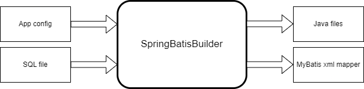

# Motivation
If you have ever worked with MyBatis and Spring, you've probably wondered about the same thing: Can CRUD operations be generated based on DDL? 
If you haven't explored that before, chances are you've done enough copy-pasting and fixing already. This simple project aims to generate CRUD operations based on templates.

## Goals
- Learn about new Java features and GitHub workflows
- Create a straightforward project that can be easily modified, allowing anyone to tailor the templates
- Support the generation of Java boilerplate code and XML mapper
- Support the most important MyBatis 3+ features in the generated files

## Why not use an existing generator?
Existing generators tend to be quite generic, making it challenging to tailor the results for your specific needs. There's no point in generating something if you end up spending the same amount of time fixing the generated code.

# How it works

It utilizes [FreeMarker](https://freemarker.apache.org/) templates for code generation.

# Disclaimer
This is an experimental project intended for learning and exploring the capabilities of a template-based generator. It's likely far from perfect but open to improvements.
The templates in the repository are crafted to be used in specific projects, so you'll need to modify them to suit your needs.

# Example
- [App config](./src/main/resources/config.yaml)
- [Input SQL](./src/main/resources/example.sql)
- [Output folder](./example) with the generated files

# Requirements
- Java 20+
- Gradle 8.5 (use the wrapper from the repo)
- MyBatis 3+ to use the generated code

# Contribution
Feel free to open an issue with a proposed idea/bug or pick one of the TODOs below and open a pull request with the implementation.

## TODOs
- add UuidTypeHandler if UUID is used as a member type
- add more MyBatis typeHandler
- add implementation to generate 'findBy<ForeignKey>' operations
- handle space-padding -> call TRIM function in the mapper XML